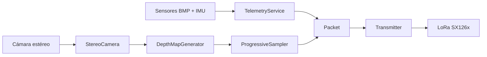
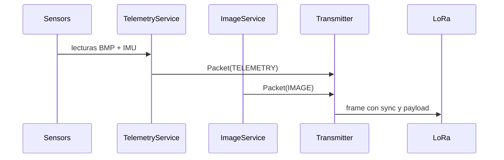



    

    
    
    
    

TlaliNantli2026-Flight-Computer es la computadora de vuelo del equipo TlaliNantli para el concurso CanSat 2026.
Su objetivo es adquirir telemetría y visión estéreo, empaquetarla en un protocolo
ligero y transmitirla en tiempo real durante el vuelo.

> [!NOTE]
> Este repositorio documenta la arquitectura del sistema, el diseño y los resultados. El código fuente no está disponible públicamente.

## Contenido

- [Visión general](#visión-general)
    - [Resumen](#resumen)
    - [Objetivos de vuelo](#objetivos-de-vuelo)
- [Hardware](#hardware)
- [Arquitectura](#arquitectura)
    - [Diagrama general](#diagrama-general)
    - [Componentes principales](#componentes-principales)
- [Flujo de datos](#flujo-de-datos)
    - [Telemetría](#telemetría)
    - [Imagen estéreo](#imagen-estéreo)
    - [Mensajería y envío](#mensajería-y-envío)
- [Capturas](#capturas)

## Visión general

### Resumen

El sistema lee presión/temperatura, IMU y genera un mapa de profundidad a partir
de una cámara estéreo de doble lente. La telemetría y las muestras de imagen se
convierten a bytes, se encapsulan en paquetes sincronizados y se transmiten por
LoRa con el módulo SX126x.

> [!NOTE]
> La cámara es una sola unidad estéreo que entrega un frame con ambos lentes;
> el par se separa por mitades para construir la profundidad.

### Objetivos de vuelo

- Medir variables atmosféricas y dinámicas en tiempo real.
- Reconstruir profundidad en 128x72 píxeles de forma progresiva.
- Enviar telemetría y visión con un protocolo compacto y robusto.
- Activar el autogyro al detectar descenso sostenido después de 200 m.

> [!IMPORTANT]
> El autogyro se activa por lógica de descenso, no por temporizador fijo.

## Hardware

La computadora de vuelo está construida alrededor de una Raspberry Pi Zero 2W e integra
sensores ambientales, visión estéreo, comunicación de largo alcance y subsistemas
de despliegue de carga útil.

    

### Componentes

- **Raspberry Pi Zero 2 W**: unidad principal de procesamiento.
- **BMP180**: sensor de temperatura, presión y altitud relativa.
- **MPU6050**: sensor de aceleración y velocidad angular.
- **Cámara estéreo**: adquisición de imagen para reconstrucción de profundidad.
- **Módulo LoRa SX126x**: transmisión de telemetría e imagen de largo alcance.
- **Electroimán**: mecanismo de liberación del autogyro controlado por GPIO.

> [!NOTE]
> El electroimán inicia activado y se desactiva para liberar el autogyro.

## Arquitectura

### Diagrama general

### Componentes principales

- **TelemetryService**: lee BMP/IMU, convierte unidades y escala datos.
- **ImageService**: dispara la captura, genera profundidad y sirve muestras.
- **StereoCamera**: captura un frame, separa izquierda/derecha y rectifica.
- **DepthMapGenerator**: calcula disparidad y normaliza a 8 bits.
- **ProgressiveSampler**: recorre el mapa por patrones 8x8 y entrega bloques.
- **Transmitter**: empaqueta y envía frames por LoRa.

> [!NOTE]
> El muestreo progresivo permite reconstruir primero una imagen global y luego
> detalles finos sin bloquear la transmisión.

## Flujo de datos

### Telemetría

1. BMP180 mide temperatura, presión y altitud relativa.
2. IMU entrega aceleración y rotación por ejes.
3. Se escalan los valores para enviar enteros compactos.
4. Se construye `Telemetry` y se empaqueta en `Packet`.

### Imagen estéreo

1. La cámara captura un frame 2560x720 con ambos lentes.
2. Se convierte a escala de grises y se separa en izquierda/derecha.
3. Se aplica remapeo con mapas de rectificación.
4. Se calcula disparidad y se normaliza a un mapa 8-bit.
5. Se reduce a 128x72 y se muestrea en bloques 8x8.

> [!TIP]
> Cada muestra de imagen contiene 144 bytes (16 x 9) para un patrón específico.

### Mensajería y envío

> [!IMPORTANT]
> El envío de imagen es oportunista: se activa solo si la telemetría habilita
> la captura y el servicio no está procesando.

## Capturas

    
    

