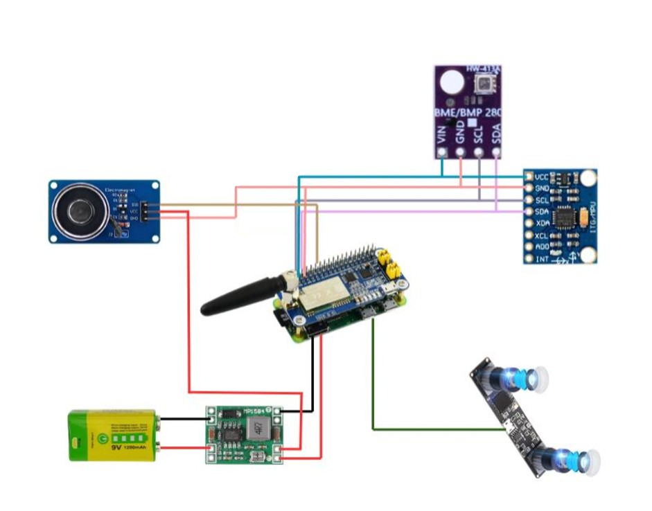
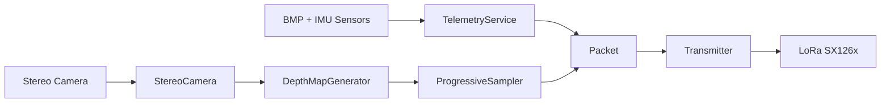
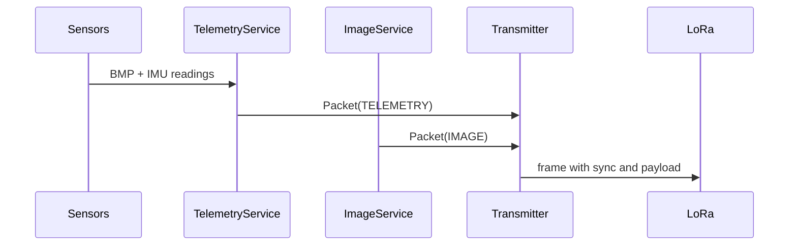
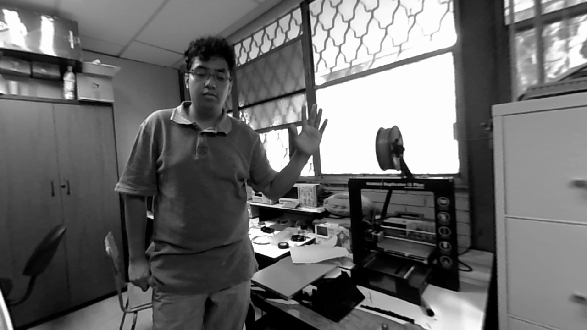
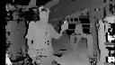

    

    
    
    
    

TlaliNantli Flight Computer is the onboard flight computer for the TlaliNantli team at the CanSat 2026 contest.
Its goal is to acquire telemetry and stereo vision, pack it into a lightweight
protocol, and transmit it in real time during flight.

> [!NOTE]
> This repository documents the system architecture, design, and results. Source code is not publicly available.

## Contents

- [Overview](#overview)
    - [Summary](#summary)
    - [Flight objectives](#flight-objectives)
- [Hardware](#hardware)
- [Architecture](#architecture)
    - [High-level diagram](#high-level-diagram)
    - [Main components](#main-components)
- [Data flow](#data-flow)
    - [Telemetry](#telemetry)
    - [Stereo image](#stereo-image)
    - [Messaging and transmission](#messaging-and-transmission)
- [Captures](#captures)

## Overview

### Summary

The system reads pressure/temperature and IMU data, then generates a depth map
from a dual-lens stereo camera. Telemetry and image samples are converted to bytes,
encapsulated into synchronized packets, and transmitted over LoRa using the SX126x module.

> [!NOTE]
> The camera is a single stereo unit that delivers both lenses in one frame;
> the pair is split in half to build depth.

### Flight objectives

- Measure atmospheric and dynamic variables in real time.
- Reconstruct depth at 128x72 pixels progressively.
- Send telemetry and vision with a compact, robust protocol.
- Trigger the autogyro after sustained descent beyond 200 m.

> [!IMPORTANT]
> Autogyro deployment is based on descent logic, not a fixed timer.

## Hardware

The flight computer is built around a Raspberry Pi Zero 2W and integrates
environmental sensing, stereo vision, long-range communication, and payload
deployment subsystems.

    

### Components

- **Raspberry Pi Zero 2 W**: main processing unit.
- **BMP180**: temperature, pressure, and relative altitude sensing.
- **MPU6050 IMU**: acceleration and angular velocity measurements.
- **Stereo Camera**: stereo image acquisition for depth reconstruction.
- **SX126x LoRa Module**: long-range telemetry and image transmission.
- **Electromagnet**: autogyro release mechanism controlled through GPIO.

> [!NOTE]
> The electromagnet starts enabled and is disabled to release the autogyro.

## Architecture

### High-level diagram

### Main components

- **TelemetryService**: reads BMP/IMU, converts units, and scales data.
- **ImageService**: triggers capture, builds depth, and serves samples.
- **StereoCamera**: captures a frame, splits left/right, and rectifies.
- **DepthMapGenerator**: computes disparity and normalizes to 8-bit.
- **ProgressiveSampler**: walks the map in 8x8 patterns and yields blocks.
- **Transmitter**: packs and sends frames over LoRa.

> [!NOTE]
> Progressive sampling reconstructs a coarse image first, then fills finer details
> without blocking transmission.

## Data flow

### Telemetry

1. BMP180 measures temperature, pressure, and relative altitude.
2. IMU provides acceleration and rotation per axis.
3. Values are scaled to send compact integers.
4. `Telemetry` is built and packed into `Packet`.

### Stereo image

1. The camera captures a 2560x720 frame with both lenses.
2. The frame is converted to grayscale and split into left/right.
3. Rectification maps are applied.
4. Disparity is computed and normalized to 8-bit.
5. The map is resized to 128x72 and sampled in 8x8 blocks.

> [!TIP]
> Each image sample carries 144 bytes (16 x 9) for a specific pattern.

### Messaging and transmission

> [!IMPORTANT]
> Image transmission is opportunistic: it starts only if telemetry enables capture
> and the service is not already processing.

## Captures

    
    

